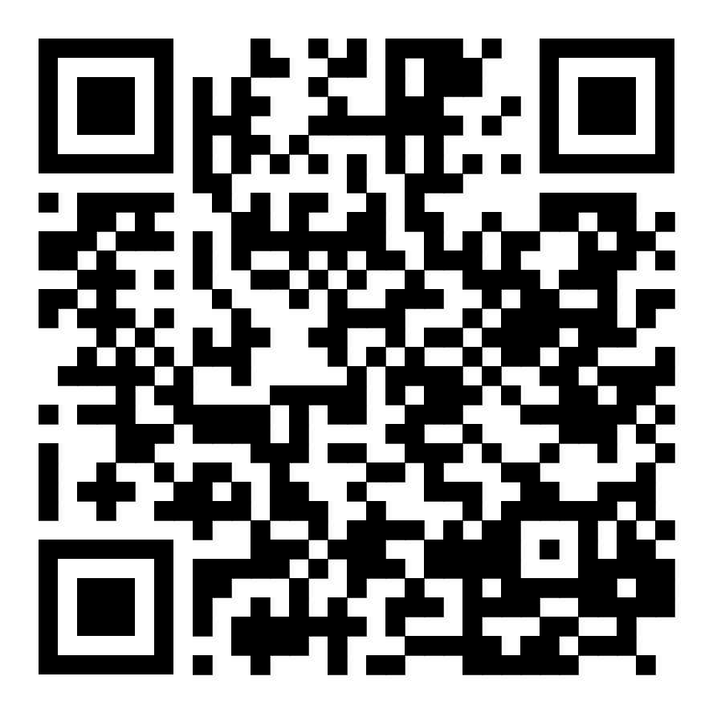

# Tabla de contenidos

1. [Microfrontends](./docs/00-microfrontends.md)
2. [Módulos en JS](./docs/01-js-modules.md)
3. [Microfrontends con VanillaJS](./docs/02-vanilla-microfrontends.md)
4. [Microfrontends con frameworks JS](./docs/03-fwks-microfrontends.md)
5. [Casos de uso](./docs/04-use-cases.md)
6. [Próximos pasos](./docs/05-next-steps.md)

## QR repositorio

