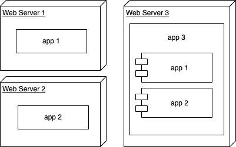

# Microfrontends

Son aplicaciones independientes que pueden lanzarse en modo standalone pero también pueden ser inyectadas en un contenedor para crear aplicaciones más complejas mediante composición. Cada una de estas aplicaciones en independiente y puede ser desarrollada por equipos diferentes.

De esta forma podemos tener, por ejemplo en un banco, una aplicación para realizar pagos y otra para recargar teléfonos móbiles. Cada una pueda estar desplegada de forma independiente y mantenida por equipos diferentes. Luego haciendo referencia a esas mismas aplicaciones sin introducir cambios en ellas podemos crear una nueva mediante composición sin esfuerzo adicional resultando en una aplicación compuesta de 2 microfrontends.

## 1 - Tabla de contenidos

1. [Microfrontends](./README.md)
2. [Módulos en JS](./docs/01-js-modules.md)
3. [Microfrontends con VanillaJS](./docs/02-vanilla-microfrontends.md)
4. [Microfrontends con frameworks JS](./docs/03-fwks-microfrontends.md)
5. [Casos de uso](./docs/04-use-cases.md)
6. [Próximos pasos](./docs/05-next-steps.md)

## 2 - Evolución de las aplicaciones JavaScript

Partimos de un inicio complicado para las aplicaciones Javascript. Es un lenguaje que originalmente se utilizaba sobre todo para pequeñas animaciones e interacciones, la lógica de negocio se manejaba en tecnologías como PHP y JSP. ¿Por qué? Porque si tratamos de usar Javascript plano pronto nos enonctramos limitaciones como en el ejemplo de [@panaderia/vanilla](./panaderia/vanilla/):

* **La gestión de dependencias es muy complicada:** tenemos que llevar un orden concreto de forma manual que es muy complicado de escalar
* **Es bloqueante:** impedirá cualquier acción por parte del usuario hasta que no termina la carga. Esto es especialente doloroso en navegadores antiguos que no cuentan con motores de renderizado tan potentes como los modernos.

Sin embargo, con el paso de los años se ha dedicado esfuerzo en ir solventando los problemas que evitaban usar Javascript como lenguaje principal. Esto ha permitido la aparición de aplicaciones que se ejecutan 100% en el lado del cliente trayendo ventajas como:

* **Alivian la carga en el servidor:** evitamos hacer composiciones de archivos HTML de forma dinámica en servidor lo que puede llegar a ser muy costoso. En su lugar, delegamos este trabajo a la máquina del cliente que quiere consumir la aplicación.
* **Arquitecturas más limpias:** permite pasar de arquitecturas monolíticas a arquitecturas distribuidas donde cada parte se especializa en hacer bien una sola cosa. Este tipo de arquitecturas son más mantenibles, más resilientes y más fáciles de escalar.
* **Ofrecen una mejor experiencia de usuario:** permite controlar todas las interacciones del usario con la aplicación sin momentos "en blanco" entre la carga de diferentes páginas que si encontramos en tecnologías como PHP y JSP.

En este repositorio vamos a hacer foco en un aspecto fundamental que permitió la proliferación de las aplicaciones en lado de cliente: la evolución de las soluciones de modulos Javascript.

## 3 - Desafíos comunes (TODO)

Este tipo de planteamiento presenta algunos desafíos como:
* Carga asíncrona: si tengo que cargar todo el contenido de cada microfrontends puedo llegar rápidamente a un límite en el que la app ya no es usable
  * Resolución de dependencias comunes: si cada aplicación carga sus dependencias de forma aislada tendremos una situación parecida al de la carga asíncrona. Llegaremos rápidamente a un límite en el que la app ya no es usable. Hay que encontrar formas para poder compartir dependencias comunes entre los diferentes microfronteds.
* Comunicación entre aplicaciones: tiene que existir una pieza de comunicación transversal para que los diferentes microfrontends puedan intercambiar datos sin que tengamos que realizar un desarrollo adicional
* Unificación de dependencias: todas las apps comparten las dependencias. No permite tener versiones diferentes de una librería por ejemplo. Este tipo de solución es más susceptible a errores a la hora de desplegar evolutivos de esas dependencias compartidas. Hay soluciones tipo NX que te avisan de cuales son los proyectos afectados. Esto con una buena estrategia de testing debería ser suficiente.

