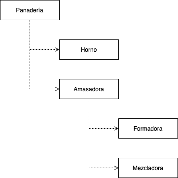

# Módulos en JavaScript

El concepto de módulo es muy intuitivo, probablemente cuando lo escuchamos imaginamos una pieza que en conjunto con otras forman un sistema más complejo. La utilidad principal de este concepto es ayudarnos a definir las dependencias entre diferentes partes del sistema.

Es importante no confundir módulo con el concepto de API. Este se refiere a los Inputs/Outputs de partes del software.


## 1 - Tipos de módulos

Hasta el año 2015, cuándo se introduce el estándar ES6 de JS y ESM(ECMAScript Modules), no había un estándar oficial para la definición y carga de módulos. Esto implica que desde la creación del lenguaje en 1995 tenemos un periodo de 20 años en los que la propia comunidad JS ha tenido que definir sus propias formas de trabajar con módulos. Es por esto que a día de hoy tenemos varias formas de definir y cargar módulos muy extendidas.

Es conveniente utilizar una solución para modularizar nuestros sistemas JS porque al construir una aplicación nos podemos encontrar muy pronto con serios de escalabilidad como:

* **Contaminación del contexto global:** por defecto trabajamos sobre el contexto global, una colisión de nombres puede llevar a errores en nuestro sistema
* **Gestión manual de dependencias:** tenemos que cargar los archivos en un orden concreto, de lo contrario nuestro sistema falla
* **Carga síncrona:** tenemos que esperar hasta que se descargan e interpretan todas las dependencias para que nuestro sistema funcione


### 1.1 - Revealing Module Pattern

Esta estrategia se basa en la uso de funciones en Javascript para aislar el contexto de cada módulo. El punto de entrada en un sistema que use "Revealing Module Pattern" será un IIFE (Immediately Invoked Function Expression) como se puede ver en el ejemplo de [panaderia rmp](./panaderia/rmp).

#### Estructura

```javascript
(function() {
  function foo() {
    // ...
  }

  foo();
})()
```

#### ¿Qué soluciona?

- [x] Contaminación del contexto global
- [ ] Gestión manual de dependencias
- [ ] Carga síncrona


### 1.2 - CJS (Common JS)

Surge sobre el año 2009 como una serie de pautas para crear un sistema de módulos en JavaScript. Se hace muy popular porque el equipo de NodeJS implementó un sistema para la carga de módulos CJS en este entorno de ejecución JS.

#### Estructura

```javascript
/**
 * module.js
 */
module.exports = {
  foo: function() {},
  // ....
} 

/**
 * main.js
 */
const module = require('./module.js');

module.foo();
```

#### ¿Qué soluciona?

- [x] Contaminación del contexto global
- [x] Gestión manual de dependencias
- [ ] Carga síncrona

#### Limitaciones

El mayor problema de esta estrategia es que no puede ser usada en los navegadores directamente. Es necesario compilar este código para que pueda ser interpretado correctamente.


### 1.3 - AMD (Asynchronus Module Definition)

Nace cuando todavía solo existian las soluciones RMP y CJS. Revoluciona el entorno JS en navegador porque es una alternativa que no necesita de una fase de compilación, funciona nativamente en el navegador y además soluciona el problema de la carga síncrona. Especialmente útil para aplicacines grandes.

#### Estructura

```javascript
require(
  ['dependencia1', 'dependencia2'],
  function(dependencia1, dependencia2) {
    // Código de módulo

    return {
      // API publica del módulo
    }
  }
);
```

#### ¿Qué soluciona?

- [x] Contaminación del contexto global
- [x] Gestión manual de dependencias
- [x] Carga síncrona

#### Limitaciones

Es necesario utilizar una librería para la carga de los módulos como [RequireJS](https://requirejs.org/).


### 1.4 - UMD (Universal Module Definition)

Podemos entender UMD como diferentes patrones complejos para que el código se pueda cargar en diferentes entornos.

### Estructura

Existen varios patrones pero algunos comunes son:

**AMD + Browser nativo**

```javascript
((root, factory) => {
  if (typeof define === 'function' && define.amd) {
    // AMD
    define('myModuleName', ['deependencyModule1', 'dependencyModule2'], factory);
  } else {
    // Browser nativo
    root.myModuleName = factory(root.deependencyModule1, root.dependencyModule2);
  }
})(
  // `self` en browser no es undefined
  typeof self !== 'undefined' ? self : this,
  (deependencyModule1, dependencyModule2) => {
    // Módulo

    return {
      // API publica del módulo
    };
  }
);
```

**AMD + CJS**

```javascript
(
  define => define(
    (require, exports, module) => {
      const dependencyModule1 = require('dependencyModule1');
      const dependencyModule2 = require('dependencyModule2');

      // Módulo

      module.export = {
        // API publica del módulo
      };
    }
  )
)(
  typeof module === 'object' && module.exports && typeof define !== 'function'
    // CJS -> factory = () => module.exports
    ? factory => module.exports = factory(require, exports, module)
    // AMD
    : define
);

```

Es una solución ampliamente utilizada precisamente porque permite ejecutar el mismo código en diferentes entornos. Es complejo definir módulos UMD de cero pero para esto existen herramintas como Webpack y Rollup.


### 1.5 - ESM (Ecmascript Modules)

Es la solución oficial para la definición y carga de módulos en Javascript. Se introduce con el estándar ES6 en 2015, inspirado por la forma de definir módulos en Webpack.

Hoy en día es el estándar más extendido, el código Javascript moderno se escribe utilizando ESM.

### Estructura

Existen varios patrones pero algunos comunes son:

**AMD + Browser nativo**

```javascript
/**
 * dependency.js
 */
export function method() {
  // Do something...
}

/**
 * module.js
 */
import { method } from './dependency.js';

method();
```

#### ¿Qué soluciona?

- [x] Contaminación del contexto global
- [x] Gestión manual de dependencias
- [x] Carga síncrona

#### Limitaciones

El nombre de los módulos debe estar explicitamente definido al ejecutarlo nativamente en el navegador.


## 2 - Empaquetadores

Rollup

Webpack


## 3 - Ejemplo práctico de módulos JS

Vamos a partir de la implementación del siguiente diagrama para entender las diferentes soluciones que existen en JS para definir módulos.



Empezamos implementando este diagrama [en es5](./panaderia/es5). Este mismo código lo podemos transformar manualmente en:

* [RMP](../panaderia/rmp)
* [CJS](../panaderia/cjs)
* [AMD](../panaderia/amd)
* [UMD](../panaderia(umd))
